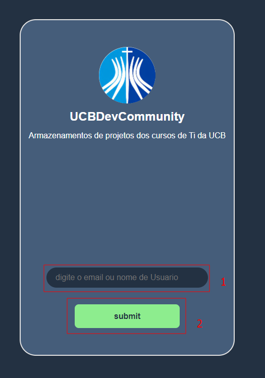

# Tutorial para se inscrever na UCBDevCommunity

Aqui será mostrado um passo a passo de como deve ser feito para realizar a inscrição na UCBDevCommunity.

## sumário

- [1 Passo: Acessar a página de inscrição](#passo1)
- [2. Passo: realizar a inscrição](#passo2)
- [3. Passo: Validar a inscrição via Email](#passo3)
  
 

## Passo 1: Acessar a página de inscrição

Utilizando [esse link para a inscrição na organização](https://www.google.com), você entrará no site para a inscrição.

 

## Passo 2: Realizar a inscrição

Digite no campo de insersão o seu usuário do github(Preferência) ou email para cadastrar na organização (email será utilizado para criação de novo usuário do github).

 

## Passo 3: Validar a inscrição via Email

Vá até o seu email(email digitado no campo, ou email da sua conta do github) e aceite o pedido de inscrição da organização.

