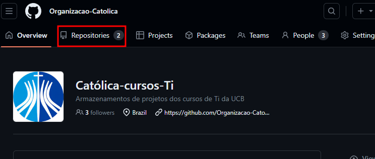
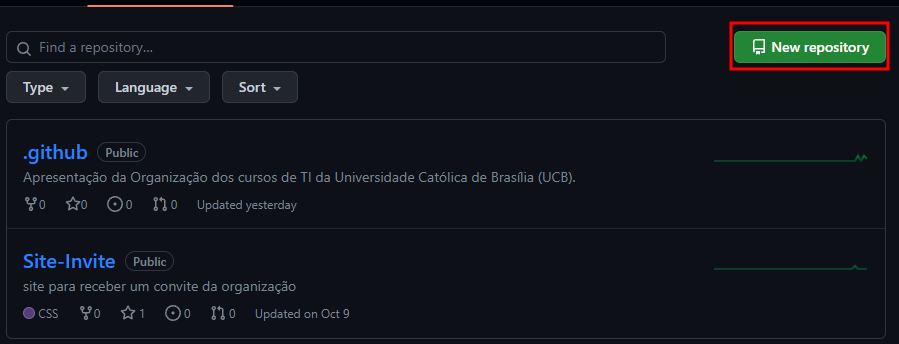

# Tutorial introdutório para adição de um repositório

Aqui será mostrado um passo a passo de como deve ser feito a criação dos repositórios para a organização da UCB TI, principalmente no que diz respeito na parte de nomenclatura dos repositórios.

## sumário

- [1 Passo: Acesso à Página da Organização](#passo1)
- [2. Passo: Criar um Novo Repositório](#passo2)
- [3. Passo: Preencher as Informações do Repositório](#passo3)
- [4. Passo: Configurar Opções Adicionais (opcional)](#passo4)

## Passo 1: Acesso à Página da Organização

Na página da organização, localize e clique no separador "Repositórios" a esquerda. É aqui que pode ver todos os repositórios da organização.

## Passo 2: Criar um Novo Repositório

Na página da lista de repositórios da organização, clique no botão verde "Novo" localizado no canto superior direito. Isso abrirá a página de criação de um novo repositório.

## Passo 3: Preencher as Informações do Repositório

Preencha as informações básicas do repositório, incluindo:

- Nome do Repositório: Escolha um nome descritivo para o repositório.
- Descrição: Adicione uma breve descrição do repositório (opcional).
- Visibilidade: Você pode selecionar entre "Público" ou "Privado" para definir a visibilidade do repositório.
- Inicialização do README: Selecione esta opção se desejar criar um arquivo README.md inicial.
- .gitignore: Escolha um arquivo .gitignore adequado para o seu projeto.
- Licença: Selecione uma licença se desejar (opcional).

Abaixo das opções de criação, você verá um campo "Owner". Certifique-se de que a organização seja selecionada corretamente.

Depois de preencher as informações, role para baixo e clique no botão "Criar repositório".

## Passo 4: Configurar Opções Adicionais (opcional)

Após criar o repositório, você pode configurar opções adicionais, como as configurações do repositório, colaboradores e assim por diante, na página do repositório.
 
Agora, você criou com sucesso um repositório dentro de uma organização no GitHub! Você pode usar este repositório para colaborar com outros integrantes da sua organização e gerenciar projetos coletivamente. Lembre-se de clonar o repositório na sua máquina local usando o Git para começar a trabalhar no seu projeto.
